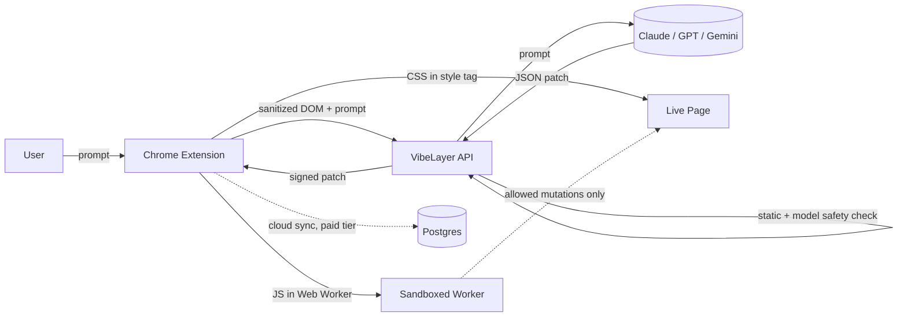

<div align="center">

# VibeLayer

### Write a prompt. Get your website — your way.

**AI-powered personalization for any website.** Describe the change in plain English, VibeLayer generates a sandboxed CSS/JS patch, and applies it live. No code. No reverse engineering. No waiting for the vendor.

<!-- Replace with a real demo GIF on launch -->


[](LICENSE)
[](CONTRIBUTING.md)
[](#)
[](#)

</div>

---

## Why VibeLayer?

- **No CSS knowledge required.** Say *"make Gmail's sidebar narrower and recolor unread badges purple"* — done.
- **Safe by construction.** Generated JS runs in a Web Worker with `fetch`, `XHR`, `WebSocket`, cookies, and `eval` blocked at the runtime level.
- **You own your patches.** Free tier stores everything locally via IndexedDB and exports as plain JSON. No lock-in, ever.
- **Open source, open core.** The extension, SDK, and self-hosted backend are MIT. Pay only for cloud sync if you want it.

## Quick start

```bash
# 1. Install the extension (dev build)
git clone https://github.com/vibelayer/vibelayer
cd vibelayer && npm install
npm run build --workspace=@vibelayer/extension
# Then load extension/dist/ as an unpacked extension in chrome://extensions

# 2. Optional: add your own LLM key (BYOK — pay zero to VibeLayer)
# Open the panel → Settings → "Bring your own key" → paste an Anthropic or OpenAI key.

# 3. Write your first prompt
# Visit any site, click the VibeLayer icon, type what you want changed.
```

## Self-hosting

```bash
cp .env.example .env
# Fill in ANTHROPIC_API_KEY (or OPENAI_API_KEY) and JWT_SECRET.
docker compose up
# API on http://localhost:8080, Postgres on :5432, Redis on :6379
```

## Architecture



The patch sandbox is the security boundary: generated JS lives inside a Web Worker created from a Blob URL. Workers have no DOM access by spec, and we additionally clobber `fetch`, `XMLHttpRequest`, `WebSocket`, `eval`, and `Function()` inside the bootstrap. The worker can request DOM mutations only via a tiny `postPatch({ op, selector, value })` vocabulary handled in the parent.

## Free vs Paid

| Capability                          | Free                   | Paid (Starter+) |
| ----------------------------------- | ---------------------- | --------------- |
| Generate patches via AI             | ✅ (BYOK unlimited)    | ✅ (included tokens) |
| Apply patches locally               | ✅ unlimited           | ✅ unlimited    |
| Local browser storage (IndexedDB)   | ✅ unlimited           | ✅              |
| Export / import patches as JSON     | ✅                     | ✅              |
| **Cloud storage & multi-device sync** | ❌                     | ✅              |
| Patch history & versioning          | ❌                     | ✅ (90 days)    |
| 30-day recycle bin                  | ❌                     | ✅              |
| Share patch via private link        | ❌                     | ✅              |
| Team shared patch library           | ❌                     | ✅ (Developer+) |

## Roadmap

- [x] Phase 0 — Working Chrome MV3 extension with Claude API
- [ ] Phase 1 — Auth, billing, preset library, Firefox + Edge
- [ ] Phase 2 — `@vibelayer/sdk` for developers, partner integrations
- [ ] Phase 3 — Community marketplace, SSO, white-label, on-prem enterprise

## Contributing

We love PRs. See [CONTRIBUTING.md](./CONTRIBUTING.md) for setup, branch naming, commit convention, and the PR checklist.

## License

MIT — see [LICENSE](./LICENSE). The cloud service at `api.vibelayer.io` is operated by the VibeLayer team and is proprietary; everything in this repo is yours to fork, self-host, and modify.
